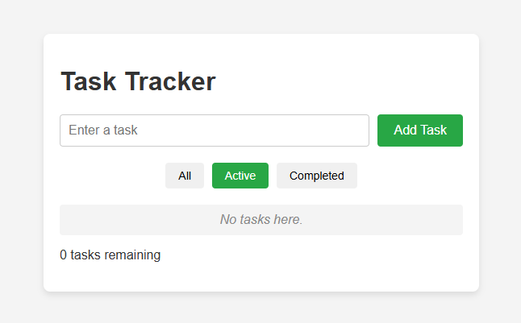

# Task Tracker

Task Tracker is a simple and responsive web application that helps users organize their daily tasks. Users can add new tasks, mark them as completed, filter tasks by status (All, Active, Completed), and delete tasks. All data is saved in localStorage, ensuring tasks remain saved even after refreshing or closing the browser.

## Features

- **Add New Tasks:** Easily create and add tasks to your to-do list.
- **Mark As Completed:** Toggle task status to keep track of finished items.
- **Filter Tasks:** View tasks by status using **All**, **Active**, and **Completed** filters.
- **Delete Tasks:** Remove individual tasks when they are no longer needed.
- **Data Persistence:** Automatically saves all task updates using `localStorage` so data isn't lost on page refresh.

## Technologies Used

- HTML
- CSS
- JavaScript

## Live Demo

[Try Task Tracker Live](https://jeffroca7-ops.github.io/task-tracker/)

## Screenshot

